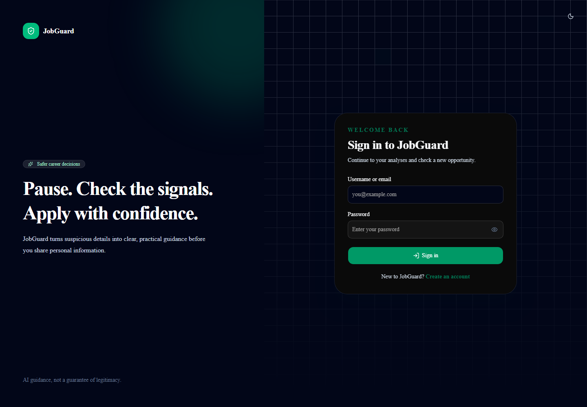
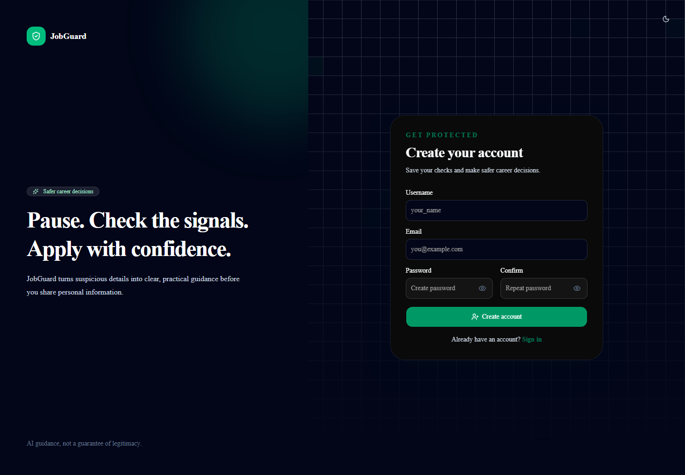
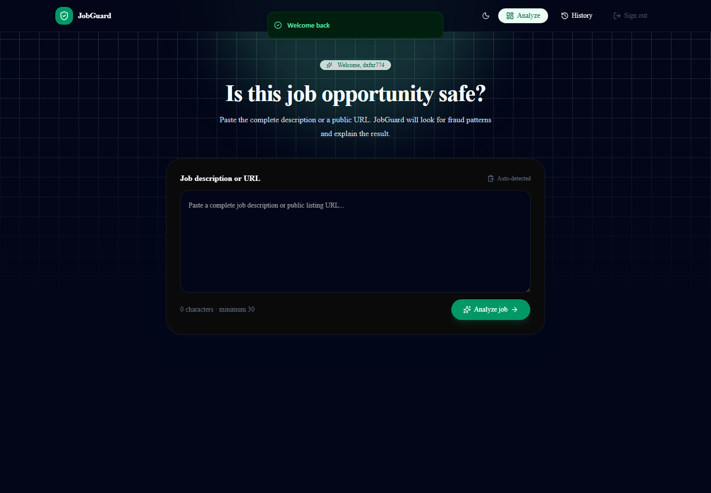
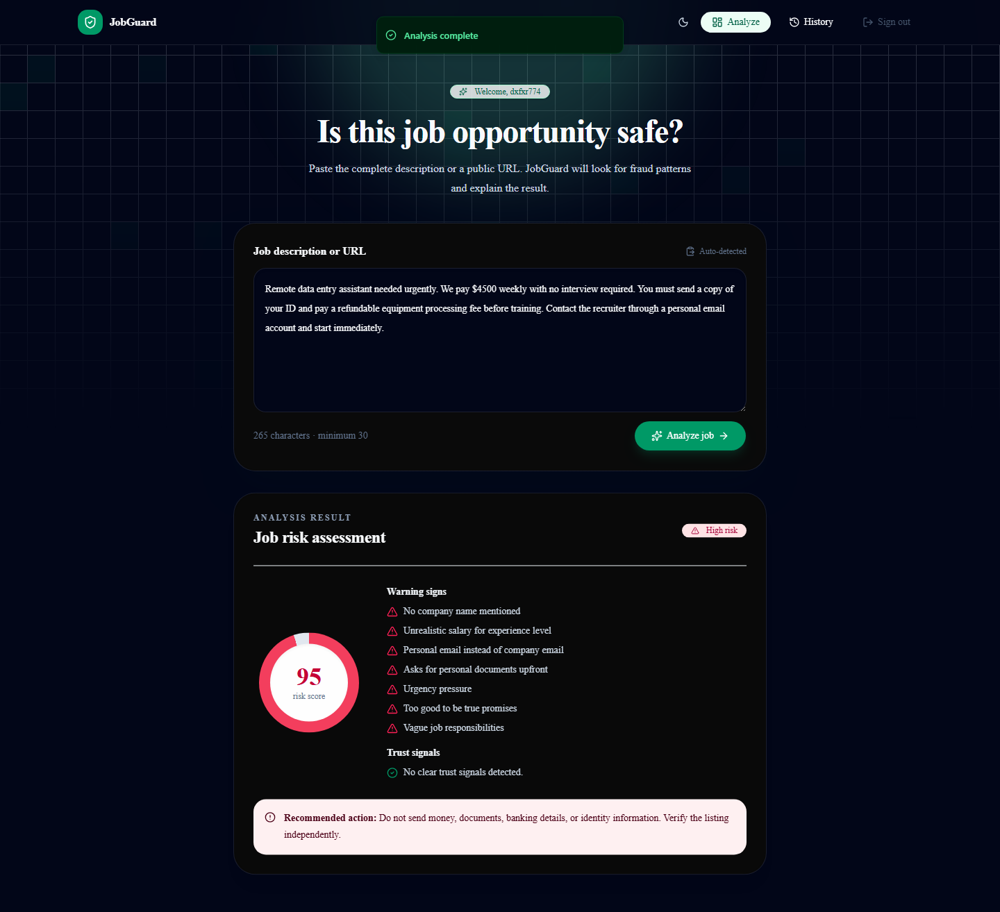
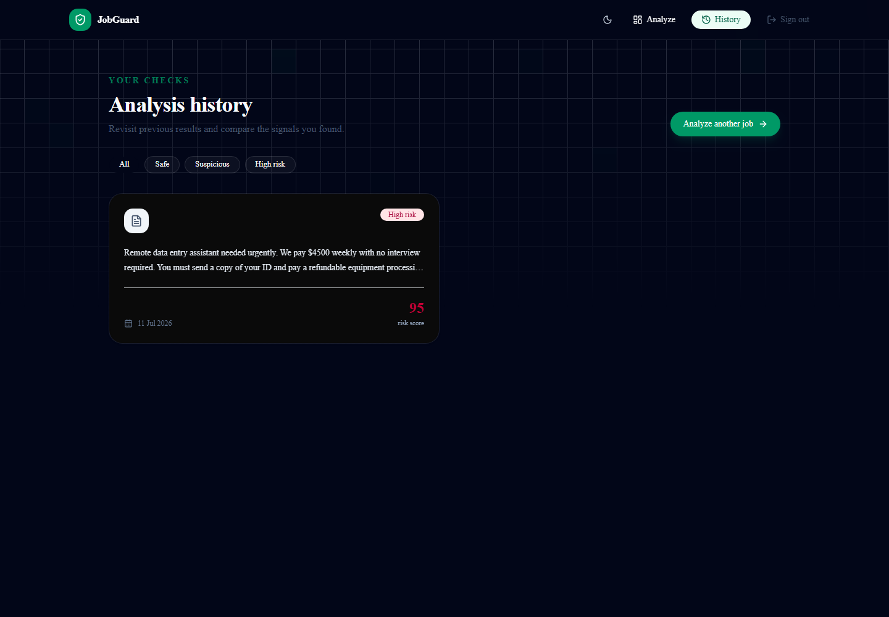
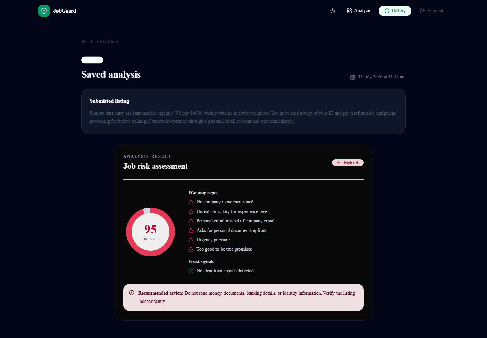

# JobGuard

JobGuard is an AI-assisted job-fraud screening web app. Authenticated users can submit a pasted job description or public job-posting URL and receive a risk score, verdict, red flags, and positive trust signals. Results are saved to the user's history.

> JobGuard provides decision support only. It does not guarantee that a job listing, company, or recruiter is legitimate.

## Current Status

The MVP is implemented and deployed. The backend is live on Render, the frontend is live on Vercel, and production smoke testing has verified registration, login, current-user lookup, logout, CORS, and API health. See [PRD.md](./PRD.md) for the complete product scope.

- Frontend: <https://job-guard-sigma.vercel.app>
- Backend health: <https://jobguard-api-knnw.onrender.com/api/health>

## Technology

- Node.js, Express 5, and TypeScript
- Next.js 15, React 19, TypeScript, and Tailwind CSS
- Framer Motion, Magic UI-style motion components, and shadcn/ui tooling
- MongoDB and Mongoose
- Zod request validation
- JWT authentication with HTTP-only cookies
- Groq (`llama-3.3-70b-versatile`) for analysis
- Axios and Cheerio for public page extraction
- Vitest, Supertest, Testing Library, and jsdom

## Local Setup

Requirements: Node.js 20+ and a MongoDB instance.

Install backend dependencies:

```bash
cd backend
npm ci
```

Install frontend dependencies:

```bash
cd frontend
npm ci
```

Copy `backend/.env.example` to `backend/.env`, then replace every placeholder:

```env
PORT=7000
NODE_ENV=development
CORS_ORIGIN=http://localhost:3000
MONGO_URI=mongodb://127.0.0.1:27017/jobguard
ACCESS_TOKEN_SECRET=replace-with-a-long-random-secret
ACCESS_TOKEN_EXPIRY=30m
REFRESH_TOKEN_SECRET=replace-with-a-different-long-random-secret
REFRESH_TOKEN_EXPIRY=7d
GROQ_API_KEY=replace-with-your-groq-api-key
```

Create `frontend/.env.local`:

```env
NEXT_PUBLIC_API_URL=http://localhost:7000
```

Never commit `.env`, `.env.local`, or place secrets directly in source files.

## Commands

Run backend commands from `backend/`:

```bash
npm run dev       # Run the API from TypeScript
npm test          # Run the automated test suite once
npm run build     # Type-check and compile into dist/
npm start         # Run the compiled API
```

Run frontend commands from `frontend/`:

```bash
npm run dev       # Run the Next.js app locally
npm test          # Run frontend component tests
npm run build     # Build the production frontend
npm start         # Serve the compiled frontend
```

The default API address is `http://localhost:7000`, and the default frontend address is `http://localhost:3000`.

Deployment platforms can check `GET /api/health` to verify that the API process is running.

## API

### Authentication

| Method | Route | Authentication | Purpose |
|---|---|---|---|
| POST | `/api/auth/register` | No | Create an account |
| POST | `/api/auth/login` | No | Sign in with username or email and set cookies |
| POST | `/api/auth/refresh-token` | Refresh cookie | Rotate session tokens |
| POST | `/api/auth/logout` | Access token | Clear tokens and end the session |
| GET | `/api/auth/me` | Access token | Return the current user |

Register:

```bash
curl -X POST http://localhost:7000/api/auth/register \
  -H "Content-Type: application/json" \
  -d '{"username":"<username>","email":"<email>","password":"<password>"}'
```

Login and store cookies:

```bash
curl -c cookies.txt -X POST http://localhost:7000/api/auth/login \
  -H "Content-Type: application/json" \
  -d '{"username":"<username>","password":"<password>"}'
```

### Analysis

| Method | Route | Purpose |
|---|---|---|
| POST | `/api/analysis/analyze` | Analyze pasted text or a public URL |
| GET | `/api/analysis/history` | List the user's saved analyses |
| GET | `/api/analysis/history/:id` | Get one owned analysis |

Analyze pasted text using the saved cookies:

```bash
curl -b cookies.txt -X POST http://localhost:7000/api/analysis/analyze \
  -H "Content-Type: application/json" \
  -d '{"input":"Paste a complete job description of at least 30 characters here."}'
```

The analysis response contains:

```json
{
  "riskScore": 72,
  "verdict": "fake",
  "redFlags": ["Requests an upfront payment"],
  "greenFlags": []
}
```

Verdict bands are `safe` (0-30), `suspicious` (31-60), and `fake` (61-100).

## Security

- Authentication tokens are stored in HTTP-only cookies and rotated through the refresh endpoint.
- Login, registration, and analysis routes are rate-limited.
- URL analysis blocks loopback, private, link-local, and unsupported destinations, including unsafe redirects.
- History queries always include the authenticated user's ID.
- Production CORS must use the exact deployed frontend origin.
- Rotate any credential immediately if it is exposed.

## Project Structure

```text
frontend/
|-- src/app/        # Next.js routes
|-- src/components/ # UI and feature components
|-- src/lib/        # API client and shared helpers
|-- src/test/       # Frontend test setup

backend/src/
|-- controller/     # Request and response logic
|-- middleware/     # Authentication, validation, and rate limits
|-- model/          # Mongoose models
|-- routes/         # Express route definitions
|-- schemas/        # Zod request schemas
|-- test/           # Shared test setup
|-- types/          # Express type extensions
|-- utils/          # AI, URL parsing, and response helpers
```

## Verification

Before opening a pull request:

```bash
cd backend
npm test
npm run build
npm audit --omit=dev

cd ../frontend
npm test
npm run build
```

Tests cover input detection and validation, protected routes, refresh-token rotation, rate limiting, URL security, AI analysis persistence, history ownership, and key frontend rendering behavior.

Production verification completed:

- Register, login, current user, and logout passed.
- Render API health passed.
- Vercel frontend returned `200 OK`.
- CORS allowed the Vercel origin.
- Temporary production smoke-test user was removed.

## Screenshots

Home:


Login:



Register:



Dashboard:



Analysis result:



History:



History detail:



## Deployment Notes

### Render backend

1. In Render, create a Blueprint from this repository. Render reads `render.yaml` and uses `backend/` as the service root.
2. Enter the secret values marked `sync: false`: `MONGO_URI`, `GROQ_API_KEY`, `ACCESS_TOKEN_SECRET`, `REFRESH_TOKEN_SECRET`, and `CORS_ORIGIN`.
3. Set `CORS_ORIGIN` to the exact Vercel production URL without a trailing slash. Multiple exact origins can be comma-separated.
4. Confirm that Render reports `/api/health` as healthy.

### Vercel frontend

1. Import this repository into Vercel and set **Root Directory** to `frontend`.
2. Add `NEXT_PUBLIC_API_URL` with the Render service URL, without a trailing slash.
3. Deploy after the backend URL is available, then update Render's `CORS_ORIGIN` with the final Vercel URL.

Production cookies use `Secure`, `HttpOnly`, and `SameSite=None`. Confirm registration, login, refresh, analysis, history, and logout on the live domains before release.

## Contributing

Follow [AGENTS.md](./AGENTS.md) for repository conventions. Keep commits focused, do not commit secrets, and include test/build results in pull requests.
